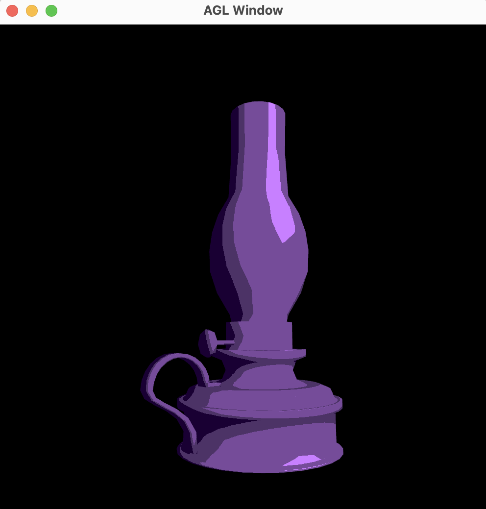
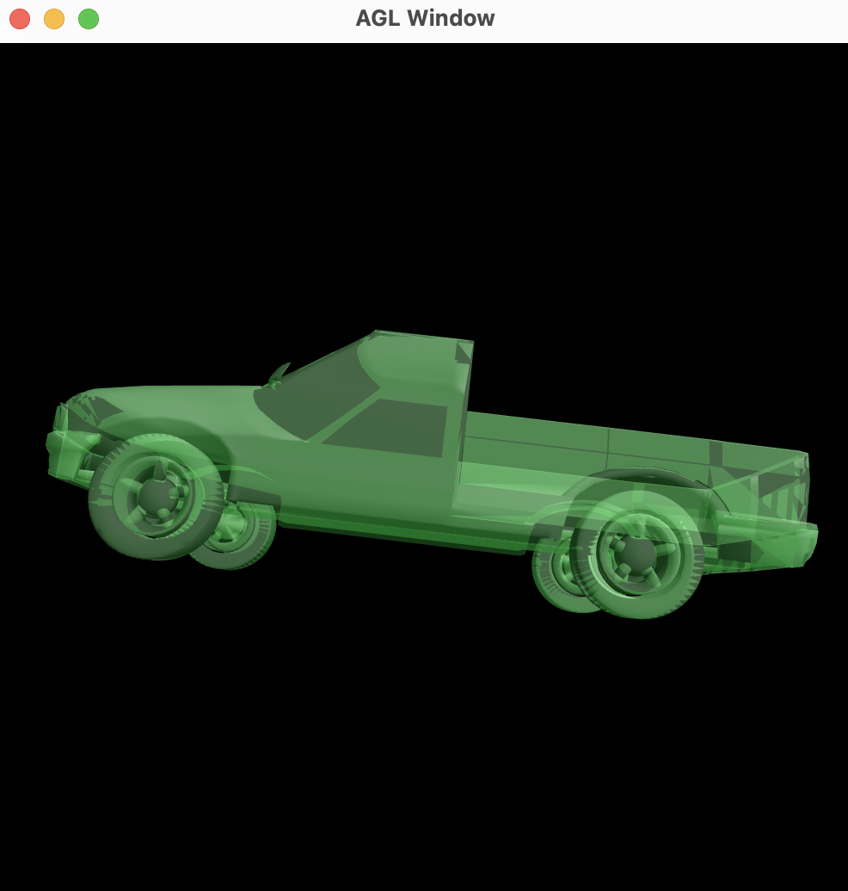
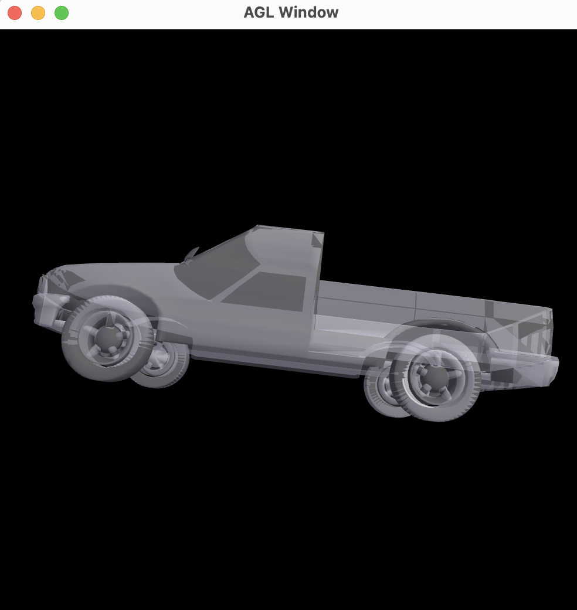

# mesh-viewer

Implements a simple PLY viewer

TODO: Add a representative image for your project here

## How to build

*Windows*

Open git bash to the directory containing this repository.

```
mesh-viewer $ mkdir build
mesh-viewer $ cd build
mesh-viewer/build $ cmake ..
mesh-viewer/build $ start mesh-viewer.sln
```

Your solution file should contain two projects: `mesh-viewer` and `test-ply-mesh`.
To run from the git bash command shell, 

```
mesh-viewer/build $ ../bin/Debug/test-ply-mesh.exe
mesh-viewer/build $ ../bin/Debug/mesh-viewer.exe
```

*macOS*

Open terminal to the directory containing this repository.

```
mesh-viewer $ mkdir build
mesh-viewer $ cd build
mesh-viewer/build $ cmake ..
mesh-viewer/build $ make
```

To run each program from build, you would type

```
mesh-viewer/build $ ../bin/mesh-viewer
```

## Demo of basic features

TODO: Document the core features of your viewer (shaders + models)

Features:
1. next model - n or N goes to the next model:
 
(https://user-images.githubusercontent.com/98035309/228309226-be780d20-aa25-4262-bf36-4a2ed069d759.mov)

2. previous model - p or P goes to the previous model:


3. go through shaders - s or S cycles through different shaders:
    normals
    per-vertex phong
    per-pixel phong
    toon
    jellofy
    glass
    vroom
    wiggle
    color-change


4. camera movement - Left-click-drag orbits the camera around the model:


5. z or x - zooms in and out of the model


## Unique features 

TODO: Show the unique features you made

Unique Features:
1. Toon shader - A cartoon shader:


2. Jellofy shader - A transparent green shader:


3. Glass shader - A clear shader:


4. Vroom shader - Vertices animated to move mesh forwards:


5. Color change shader - Gradients/Changes the color of the object:

